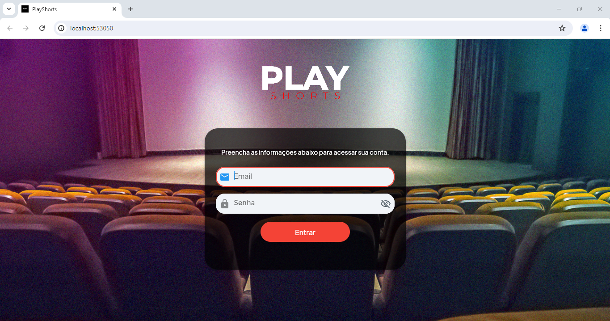
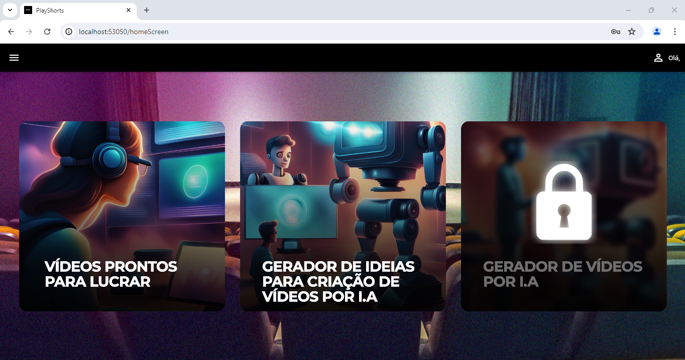
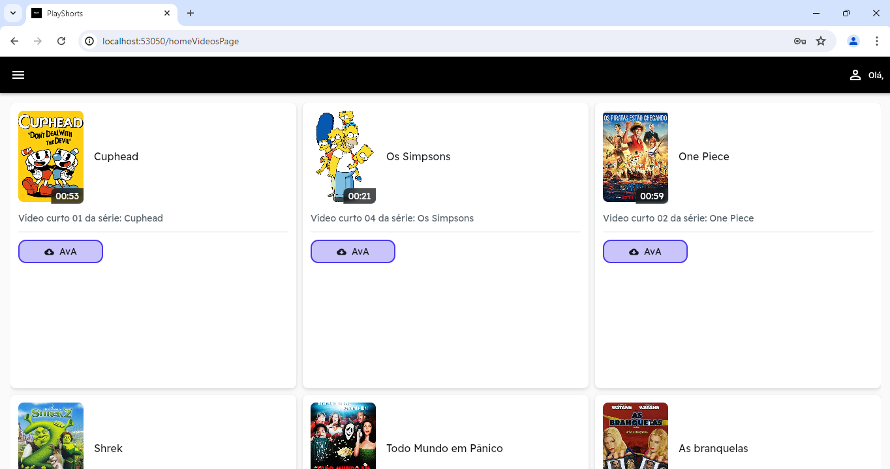
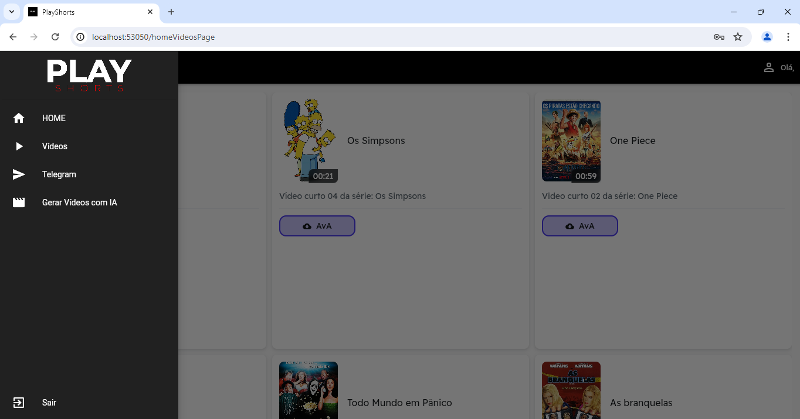

# PlayShorts

PlayShorts é um projeto desenvolvido em Flutter Web com integração ao Firebase. Este aplicativo permite aos usuários assistir vídeos curtos de diversas séries e acessar outras funcionalidades, como geração de vídeos com IA.

## Funcionalidades

- **Autenticação de Usuários**: Login e registro de usuários.
- **Catálogo de Vídeos**: Navegação por um catálogo de vídeos curtos de séries populares.
- **Geração de Vídeos com IA**: Ferramenta para gerar ideias e vídeos automaticamente usando IA.
- **Integração com Telegram**: Opção para compartilhar vídeos diretamente no Telegram.

## Tecnologias Utilizadas

- **Flutter Web**: Framework para desenvolvimento web.
- **Firebase**: Backend para autenticação e armazenamento de dados.
- **Git**: Controle de versão.

## Capturas de Tela

### Tela de Login



### Tela Inicial



### Catálogo de Vídeos




## Estrutura do Projeto

```plaintext
lib/
├── main.dart
├── screens/
│   ├── login_screen.dart
│   ├── home_screen.dart
│   ├── video_catalog_screen.dart
│   └── ...
├── widgets/
│   ├── video_card.dart
│   ├── drawer.dart
│   └── ...
├── services/
│   ├── firebase_auth_service.dart
│   └── video_service.dart
└── models/
    ├── user.dart
    └── video.dart
```

## Configuração e Instalação

1. Clone este repositório:
   ```sh
   git clone https://github.com/seu-usuario/play-shorts.git
   ```
2. Navegue até o diretório do projeto:
   ```sh
   cd play-shorts
   ```
3. Instale as dependências:
   ```sh
   flutter pub get
   ```
4. Configure o Firebase:
   - Siga as instruções no [Firebase Console](https://console.firebase.google.com/) para adicionar um novo projeto.
   - Adicione os arquivos `google-services.json` (para Android) e `GoogleService-Info.plist` (para iOS) aos diretórios correspondentes.
   - Atualize o arquivo `firebase_options.dart` com as suas credenciais do Firebase.

5. Execute o aplicativo:
   ```sh
   flutter run -d chrome
   ```

## Contribuição

1. Faça um fork do projeto
2. Crie uma nova branch com sua feature:
   ```sh
   git checkout -b minha-feature
   ```
3. Faça commit das suas mudanças:
   ```sh
   git commit -m 'Adiciona minha feature'
   ```
4. Faça push para a branch:
   ```sh
   git push origin minha-feature
   ```
5. Abra um Pull Request

## Licença

Este projeto está licenciado sob a licença MIT. Veja o arquivo [LICENSE](LICENSE) para mais detalhes.
